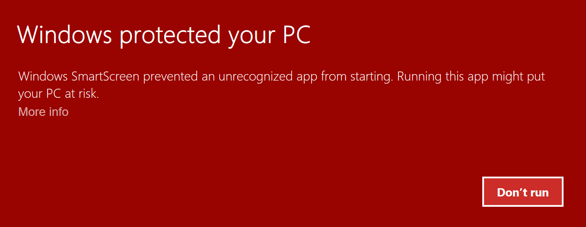
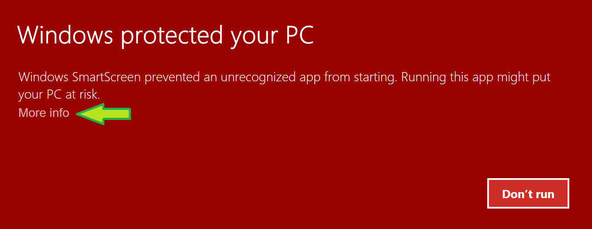
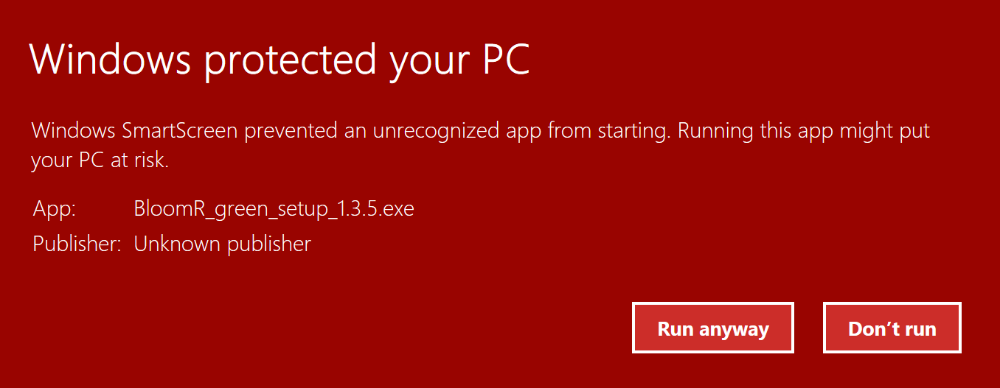

BloomR
======

*Portable R for Bloomberg and Thomson Reuters Eikon*

BloomR is a portable R distribution reshaped in order to get, manipulate and run models against Bloomberg or Thomson Reuters Eikon data.

__Focus on  Data__

<!-- Peace of mind  -->

Connecting R and Bloomberg or Eikon is difficult and time consuming. BloomR has no learning curve: extract its files on your USB flash disk, plug it into any Bloomberg or Eikon terminal where you have access and you are done.  
If you prefer to copy BloomR files on your Bloomberg or Eikon terminal, that's fine too. 

__Work with Data__

<!-- Work Straight with data  -->

BloomR has a number of functions to easily get and manipulate Bloomberg or Eikon data: for example, with a single line of code you can get the  historical data from all members of a given index in R _xts_ format.  
To save you time, BloomR functions can work in bulk with many tickers together, possibly  grouped in categories that you define, representing your portfolios, sectors, etc.

__Visualise and Communicate your Research__
	
BloomR can save the output of your models in spreadsheet format and can produce template based reports in HTML or PDF format. You may also want to export model plots as figures for your presentation.

In a business environment where you have to produce a lot of similar template based model, for compliance or reporting purposes, BloomR can feed you templates with up to the minute fresh data and release it as a HTML or PDF: the former can be delivered with the company  web site, the latter can be circulated as a document. 

__Integrate with Excel__

Your research might need integrations from other data  other  colleagues or departments. Chance there are they will feed you with Excel data. BloomR can read Excel xlsx files. It can  import data from specific Excel sheets or ranges.  
In particular, you might want to minimise the risk of errors by using Excel named ranges, e.g. BloomR will just import the `Financial_Ratios` named range from you peers and you don't have to guess where needed items might possibly be located inside the workbook. 

__Decoupling the Model Development and Production__

_Not available in this release_
You can run BloomR alone (without a Bloomberg or Eikon terminal) in _simulated mode_. In this way you might design your models and tests with artificial data and, when you think you ready  for production, you plug it into a Bloomberg or Eikon terminal and test your models with actual data.

__Reproducible Research__

BloomR was born primarily as a research tool. The process of manually download lots of ticker data through a spreadsheet and manually accommodating into your sheets, besides being time consuming,  is 
known to be prone to subtle undetectable errors.
In BloomR this can be accomplished with a script so that you, your team, your colleagues can exactly reproduce it, fix it, improve it. 

In a business environment this also facilitates the process of keeping track and documenting the data mining processes.

__No Extra Licensing Restrictions__

BloomR itself is open source and it is based on the public APIs released by  Bloomberg ([Bloomberg Open API](http://www.openbloomberg.com/open-api/)) and by [Thomson Reuters](https://developers.thomsonreuters.com/eikon-data-apis/). This means that the same  licensing terms of your Bloomberg Professional Service and Thomson Reuters Eikon service apply to data when you work with it.

BloomR Versions
-------------

BloomR comes in two versions. 

__BloomR Core__ is based on R standard GUI. It is light and convenient to run scripts on the data terminals. 

__BloomR BRemacs__  features also a sophisticated editor (based on Emacs) for writing and executing scripts and interactive code. 

__BloomR Studio__  Like BloomR BRemacs, but adds a minimal LaTeX (MiKTeX) distribution, which allows to generate both HTML and PDF reports from financial data feeds.

What's new
----------

### BloomR Casta Diva (1.4.*)

Improvements over Turandot version:

This release is a major update with significant changes.

Now both Bloomberg and Thomson Reuters Eikon are supported.
 
Bloomberg interface is now based on Rblpapi.   
BloomR comes in two versions *BloomR Core* and *BloomR BRemacs*. The latter implements an editor based on Emacs.  

__read.xlx__

`read.xlx` joins the family. With this function you can read Excel xlsx workbook sheets into R data frames.  Some features are:

* It can import all, one, or a selection of sheets, where specific sheets are requested by means of their name.
* Instead of importing all the sheets' cells, it can import only those comprised in a named range.
* It can distinguish between cells formatted as numbers, percent, text and dates,
* Date cells are recognised  whatever the language locale. 
* Blank (visual) lines are detected and automatically removed from the data frame, unless you want to keep them.
* The filter is not based on any external engine and does not requires Excel to be installed at all. It's pure R code, so you can read xlsx files on Linux systems. 

See xlx.help.html, or [xlx.help.pdf](https://github.com/AntonioFasano/BloomR/blob/master/xlx.help.pdf?raw=true) user manual for more.

The new version of the BloomR manual for lecturers (in slide format) is coming soon. 
 
 
Documentation
-------------

Find in your BloomR directory the subdirectory `help` intended for learning and reference material.  
For a self-paced introduction,  download _BloomR Classroom Companion_ from the [latest BloomR release](https://github.com/AntonioFasano/BloomR/releases/latest).

Start to get results in BloomR immediately 
----------------------------------------

__Bloomberg__

1. Download the latest [BloomR release](https://github.com/AntonioFasano/BloomR/releases/latest).
2. Run the _green_ installer: it will only extract the BloomR files on your chosen directory (perhaps on your USB drive), without further touching your system. 
3. Run "BloomR.exe" in the main folder.
4. Log to Bloomberg service on the same PC (if you are not logged already).
5. To get some data, type in the BloomR console:

			
        con <- blpConnect()                                               # Connect BloomR to Bloomberg
        bdh(c("MSFT US", "AMZN US"), "PX_LAST", start.date=Sys.Date()-5)  # Last 5 days for price of these tickers 
        blpDisconnect(con)                                                # Disconnect BloomR from Bloomberg

__Eikon__

1. Execute step 1,2,3 above
2. Log to Eikon service on the same PC (if you are not logged already).
3. To get some data, type in the BloomR console:

        # 2015 monthly prices for Microsoft 
        get_timeseries("MSFT.O", c("TIMESTAMP", "CLOSE"), "2015-01-01T00:00:00", "2016-01-01T00:00:00", "monthly")

Build instructions (for advanced users)
--------------------------------------

This section is intended only for developers willing to build BloomR themselves.
Standard users will not need this. 

The three flavours of BloomR are entirely built from the [bloomr.build.R](https://raw.githubusercontent.com/AntonioFasano/BloomR/master/bloomr.build.R). 

Since BloomR is based on several open source software, when the packages are updated, the script can automatically rebuild BloomR. For example, if a new version of R is out, running the script automatically integrates it in the BloomR build. 

Of course, the build script can be of interest for those willing to customise BloomR.  For example, to automatically add extra R packages in the installer. 

### For the impatient

Download [bloomr.build.R](https://raw.githubusercontent.com/AntonioFasano/BloomR/master/bloomr.build.R) (as a text file, *not as a HTML file*, and make sure your browser does not change ".R" extension to ".html" or ".txt"). In the console of R for Windows issue:

	source("path\to\bloomr.build.R")
	makeBloomR("path\to\workDir")

You will find your BloomR green installer _.exe_ inside `workDir`.

__Note__: the build script will download from the Internet the required files (c. 200 MB). Think of this if you have a metered connection. 

**Browser oddities**

Downloading a file _as is_  from you browser can be tangled. Normally you need to a) select  All Files in the Save-as option of the browser Save dialog and b)   double-quote the filename. In as far as the format is text (not HTML), even if you get a distorted name, like "bloomr_build_R.txt", you can always adjust the `source()`-path accordingly.   
Yes, browsers are strange sometimes. 

### More options and requirements

A decent R version is needed 3+ (perhaps older version will do).  
`.Platform$OS.type == "windows"`. `XML` and `Rcurl` packages are needed, but if missing, the build script will try to download and install them.  
R should be able to connect to the Internet.

If you want to find  `BloomR.zip` too in your work directory use:

	makeBloomR("path\to\workDir", zip = TRUE)

### Faulty Internet connection 

Since `bloomr.build.R` downloads resources  from the net,  one problem you might face is a download error.

Based on my experiences, the script does a good job in detecting download errors, despite it is always  possible that a corrupted download is not identified.

When a donwnload error is  detected,  `bloomr.build.R` makes a second attempt. You can control this with:

	makeBloomR("path\to\workDir", ndown = n)

where _n_ are the download attempts.  
When the maximum number of attempt is reached, the script exits deleting any incompleted file and emitting a message detailing the download error.

When you start over (hoping in a better connection), you might not want to download again every and each file, but only those affected by the errors. This is done with the option: 

	makeBloomR("path\to\workDir", tight = TRUE)

Windows 10 warning 
-----------------

When you run BloomR installer in Windows 10, you might might presented with the following warning: 

### Why you get it

In order to remove it, I should buy a certificate, which by the way would not make the BloomR installer safer, it would just make simpler to identify me, Antonio Fasano, as the author of the project.  
The  certificate costs money, while this project is not for profit and does not generate any. 
Anyway, BloomR is open source, so you can inspect the code to see if there is any wrong doing and, of  course, you can run an antivirus program on the BloomR installer before running it. 
Bear in mind that the installer does not require administrator privileges to be executed because it does not affect critical system services. 

### Bypass the warning

All that given, to execute the BloomR installer, identify the `More info` link as displayed in the following screenshot:

After clicking on the link, you get the following:

If you want to run the executable, click `Run anyway`. 

Credits
-------

BloomR is build upon several great pieces of open source software:

peazip from http://sourceforge.net/projects/peazip  
autohotkey from http://ahkscript.org  
Nsis from http://nsis.sourceforge.net  
innoextract from http://constexpr.org/innoextract  
Icon set Simplicio CC 3.0 by Neurovit: http://neurovit.deviantart.com  
eikonapir from https://github.com/ahmedmohamedali/eikonapir  
Rblpapi from https://cran.r-project.org/web/packages/Rblpapi/index.html  
    
<!-- Local Variables: -->
<!-- mode: markdown -->
<!-- End: -->

<!--  LocalWords:  BloomR Bloomberg CSV API BRemacs Eikon xlsx APIs
 -->
<!--  LocalWords:  Casta Turandot
 -->
