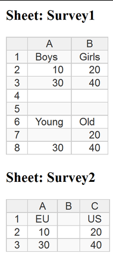

read.xlx 
========
by Antonio Fasano
-----------------


    
There is a new function  in the `read.*` family, `read.xlx`, which can read Excel xlsx workbook sheets into R data frames.  Some features are:

* It can import all, one, or a selection of sheets, where specific sheets are requested by means of their name.
* Instead of importing all the sheets' cells, it can import only those comprised in a named range.
* It can distinguish between cells formatted as numbers, percent, text and dates,
* Date cells are recognised  whatever the language locale. 
* Blank (visual) lines are detected and automatically removed from the data frame, unless you want to keep them. 
* The filter is not based on any external engine and does not requires Excel to be installed at all. It's pure R code, so you can read xlsx files on Linux systems. 


Synopsis
=======
    
    read.xlx(
        file, sheets=NULL, header.sheets=FALSE, header.ranges=FALSE, ranges=NULL,
	    skip=0, skipafter=FALSE, keepblanks=FALSE,
		general='numeric', morechar=FALSE, na.string="N.A.",
	    simplify=TRUE, info=FALSE) 


file
:   path to xlsx file.  

sheets
:   character vector with sheet names to read or NULL to read all.  

header.sheets
:   TRUE if, for all sheets, the first row is a header line to be used for column names. It can also be a logical vector whose values are TRUE (FALSE) for each sheet with (without) header.  

header.ranges
:    TRUE if, for all named ranges in `range`, the first row is a header line to be used for column names. It can also be a logical vector whose values are TRUE (FALSE) for each named range with (without) header.  

ranges
:   character vector with sheet names to read or NULL to not read use them.  

skip
:   skips the first given rows of every sheets (and currently ranges). If header are set TRUE, skipped rows depend on the value of `skipafter`  

skipafter
:   if TRUE skipped rows are counted after the (first used as) header row, else the rows are skipped above the headers, which will be the `skip+1`. Ignored without headers.  

keepblanks
:   if TRUE do not import rows or columns having only empty cells.  

general
:   maps Excel General format and other not directly managed formats to `character` or `numeric`.  

morechar
:   If FALSE do not use directly managed cell number formats, but use always R character class.  

na.string
:   character vector of strings to be interpreted as NA values during numeric conversions.  

simplify
:   remove enclosing list for a single item.

info
:   list of: sheets' name; vector whose names are ranges and values their sheets; vector whose names are ranges and values their references.  


Details
------

If `header.sheets` is a logical vector, its length should match the length of the workbook sheets, including empty sheets, or the length of `sheets` if this argument is not NULL. Similarly, if `header.ranges` is a logical vector, its length should match the length of `range`.  

`info` can be used only with `file`. The elements name  of the list returned are:
wbsheets, rgsheets, rgrefs. 


```{r setup, include=FALSE }
## Like capture.output, except it diverts the messages stream too
## (not only the output stream)
## If (non-) quiet, (don't) print pretty output
## There are no file options as in capture.output
capture.all=function(..., std=TRUE, mess=TRUE, quiet=FALSE){
    out.con.std = textConnection("out.char.std", open = "w")
    out.con.mess = textConnection("out.char.mess", open = "w")
    sink(out.con.std)
    ## divert messages too, contrary to standard capture.output
    sink(out.con.mess, type = "message")
    ## on fuction exit stop sink-ing and close connection
    on.exit({
        sink(type = "message")
        sink()
        close(out.con.std)
        close(out.con.mess)
    })

    ## Execute args in parent frame
    args <- substitute(list(...))[-1L]
    pf <- parent.frame()    
    evalVis <- function(expr) withVisible(eval(expr, pf))
    for (i in seq_along(args)) {
        expr <- args[[i]]
        tmp <- switch(mode(expr), expression = lapply(expr, evalVis), 
            call = , name = list(evalVis(expr)), stop("bad argument"))
        for (item in tmp) if (item$visible) 
            print(item$value)
    }
    on.exit()    
    sink(type = "message")
    sink()
    close(out.con.std)
    close(out.con.mess)


    if(!std) out.char.std=''
    if(!mess) out.char.mess=''
    
    if(!quiet) message(paste(out.char.std, out.char.mess, collapse='\n'))
    invisible(list(std=out.char.std, mess=out.char.mess))
}

```

Setup
-----

Currently the script is not in package form so, after downloading it,  just source the R source with:

    source('path\to\xlx.r')

```{r xlx.source, include=FALSE}
    source('xlx.R')
```


You are done.


Use it in the simplest form
----------------------------

Let us start from a sample  the spreadsheet `survey.xlsx` (which you should find together with  this manual), with consisting of an empty sheet and  two sheets `Survey1` and `Survey2` with  plain formatted  data  like the  following:

    
 


A file should come together with this manual, `survey.xlsx` which you can use to run the same code as here. 


To import the file with all sheets simply run:


```{r xlx.start, eval=FALSE}
surv=read.xlx('survey.xlsx')
```

```{r xlx.start.2, message=FALSE, include=FALSE}
require(stringr)
out=capture.all(read.xlx('survey.xlsx'), quiet=TRUE)
bar=strsplit(out$std[1], split='\r')[[1]]
bar=str_trim(rev(bar)[1])
data=paste(out$std[-1], collapse='\n')

mess=lapply(out$mess, function(x) {
    y=strsplit(x, split='\r')[[1]]
    l=length(y)
    str_trim(if(l) y[l] else x)
})
mess=paste(mess, collapse="\n")
surv=read.xlx('survey.xlsx')
require(pbapply)
pboptions(type="none")

```

```{r xlx.start.3, echo=FALSE}
message(mess, bar)
```

Above you see some info about the workbook  being processed that we will not show anymore in the following.

The result of your import is:

```{r xlx.start.4}
surv
class(surv)
lapply(surv, class)
names(surv$Survey1) 
```

Following the general convention for the `read.*` family of functions, the sheets are converted into data frames, plus data frames are wrapped into a list. The data frame comprising the list are named like the equivalent  Excel sheet, here `Survey1` and `$Survey2`.  As you guess from the output:

1. Blank sheets are by default not imported.


2. By default Excel column letters are converted to digits and set as the name of the data frame columns.

3.   Blank lines, that is whole blank rows or columns, are removed, instead single blank cells inside data tables are reported as NA.

4. By default it is possible to  identify skipped blank lines by reading the sequence of row and column numbers. 


In case cells are not plain formatted and formatting inside columns is inconsistent R will coerce incoherent cell to the column prevailing format and issue a warning. 


Import individual workbook items
-------------------------------


We can customise the default behaviour. For example let us assume we want to import only the sheet "Survey2" 


```{r xlx.single, message=FALSE}
surv= read.xlx('survey.xlsx', sheets=c('survey2'))
```

As usual for a single item `sheets=c("survey2")` can be shortened as `sheets='survey2'`

Note that, respecting Excel convention the name is not case sensitive, so `survey2` works even if the actual sheet name is `Survey2`.  The name used in the importing command will be the one stored in R, in case you later  need to address it.


Another thing is that, since we asked for a single sheet, there is no  need to wrap it in a now worthless list:

```{r xlx.single2}
class(surv)
surv

```

What about using the first sheet row as the data table names? 

```{r xlx.head, , message=FALSE}
surv=read.xlx('survey.xlsx', sheets=c("survey1", "survey2"), header.sheets=c(FALSE, TRUE))

```

With `header.sheets` we say for which imported sheets first row should be used for labelling data frame. In our case this is resp. `FALSE`, `TRUE` for  "survey1", "survey2". In fact:

```{r xlx.head2}
surv
names(surv$survey2)

```

There are no more digits for data frame names, but the names, taken from the first sheet row, are `"EU" "US"`. 

`header.sheets` are recycled. So `sheets=c("survey1", "survey2"), header.sheets=TRUE` means that for both "survey1" and  "survey2" the first row will be used for labeling.

Note that the letter case is the same as the issued command, therefore now it is lowercase, while before it was the original case used in the file. 


It is possible to query for named ranges too. The file `survey.xlsx` contains the named ranges `education` and `students`. 


```{r xlx.range, message=FALSE}
surv= read.xlx('survey.xlsx', ranges=c('education', 'students'))

```

```{r xlx.range2}
surv

```


Again we can use the first line as header:

```{r xlx.range3, message=FALSE}
surv= read.xlx('survey.xlsx', ranges='education', header.ranges=TRUE)

```

```{r xlx.range4}
surv

```


Skip an arbitrary number of initial rows 
----------------------------------------

It is possible to skip the first _n_ rows. If headers are present the skipped rows are counted after the initial header row if `skipafter=TRUE`. If `skipafter=FALSE`, the row are skipped above and the header will be the first row follwing those skipped.


```{r xlx.skip, message=FALSE}
read.xlx('survey.xlsx', skip=3)
```

Note: the first three lines are skipped. As a consequence of the skipping `Survey2` sheet results in an empty output, so only `Survey1` sheet is returned as a single data.frame.

```{r xlx.skip2, message=FALSE}
(surv=read.xlx('survey.xlsx', header.sheets=TRUE, skip=3, skipafter=FALSE))
```

Here we see the effect of `skipafter=FALSE` when `header.sheets=TRUE`. That is the first three lines are cut out, like before, and the 3+1 row is taken as header.

Separating the  headers,  the data.frame content can all be interpreted in terms of numbers. And also the NA is properly mapped as missing value. 

```{r xlx.skip3, message=FALSE}
class(surv[,1])
class(surv[,2])
```


Details for the non-causal user
-------------------------------

Sheets are converted into data frame following other R `read.*` functions' behaviour, which means that the values of a column share a common type. Anyway in the same  Excel column  different cells can have different formats. Why loosing this information? It would have been possible to use a list object to model a sheet and so retain the differences, but most of the R statistic functions can effectively operate  when at least at column level the formats are the same.
That being said, when in a column there are different cell formats the prevailing compatible styles,  will be applied to all. This will often involve the use of the R  "character" type, because it is always compatible with numeric formats too.  

Given this, recognised Excel styles and their R default equivalent are:

* number, accounting, currency, fraction, scientific: converted to R numeric format
* percent: converted to R numeric format, with a column "percent" attribute
* date: converted to R date or datetime format
* time: converted to R time format
* text: converted to R character format 
* general: converted to R number format if possible (unless otherwise asked)


To get more details about number format conversion read the following section.

__Rules for conversion of Excel number format__

In Excel the format categories are listed in the "Format Cells" menu under "Number" tab and they will be converted as follows.

1 If the prevailing format in a column is Date/Time, in whatever (local) format, cells will be converted as an appropriate R date/time format; unless `morechar==TRUE`.

2 If the prevailing format is text, cells will be stored as R character.

3 If neither 1) nor 2) apply (e.g. prevails the Excel General format) the conversion depends on the argument `general`. If `general==character` they are stored as characters. If `general==number` (default) columns are converted to numeric format using the `na.string` character string argument, if this does not succeed, they are stored in character format.

4 If the prevailing format is percentage, 3) applies, but the attribute "percent" will be added to resulting data frames in the form of a logical vector identifying columns originally displayed in percentage format.

If `morechar==TRUE` and `general==character` everything will stored in character format.
Note that for dates/times this means that the  Excel internal equivalent number will be stored as a string.

If prevailing values are incompatible with some cells,  NA will applied and warnings will be displayed. 

Note that a single cell which is not a number and is not a string `na.string` will prevent its column to be converted as a numeric column. This may change in the future.

__See how this works in practice__

```{r xlx.adv, message=FALSE}
surv=read.xlx('survey.xlsx', "survey2")
```
```{r xlx.adv2}
surv
```
             
             
If the Excel user has not set a specific cell style. All cells have the Excel "general" format and the general format is mapped to R "character".

Let us assume that the user has explicitly set the values in row 2 and 3 to the Excel number style.  Given the previous command 

```{r xlx.adv3}
 surv[[1]]
class(surv[[1]])

```

Numeric values 10 and 30 are converted to character to be compatible with the string "EU".


If you want to reduce the progress messages printed (perhaps because you are using a number of batch jobs), use:

    suppressMessages( x=read.xlx('survey.xlsx') )

You will only get one line of +'s. I am thinking if it is convenient to totally abolish even this. 

###Empty objects

The general principle is: empty objects are not returned unless they are explicitly requested.

```{r xlx.sheet3, message=FALSE}
surv=read.xlx('survey.xlsx')
names(surv)
read.xlx('survey.xlsx', c("survey2", "sheet3"))
read.xlx('survey.xlsx', "sheet3")
```


Dates oddities
-------------


Let us assume that you the locale of you Excel is English UK.

In cell A1 you enter the date `20/10/2000`. Now this is a legitimate date, because in Britain day comes before month and Excel recognise it as such. In fact if you right-click on cell and select Format->Number you will find that the category is "Date" and in the Locale drop down "English (U.K.)" is selected. 

Now let us write in cell A2 the date `10/20/2000`. You think you have written a date, but this is UK locale, so this is just an ordinary string. In fact in Format->Number you read that the category is "General". 


You may be tempted to change the category to "Date" and select "English (U.S.)"  in the Locale drop down, maybe you will also select a matching type in the Type list. 

Unfortunately this keeps being an invalid date cell. In fact, if you type `=YEAR(A1)` in cell B1, the formula extracts the year part of the date and gives 2000, while writing `=YEAR(A2)` gives `#VALUE!` to signaling the wrong date in cell A2. 

To understand things better select again Format->Number for cell A1, change Locale drop down set to "English (U.K.)" to "English (U.S.)".  You now see that the value of the displayed in the cell has automatically changed from `20/10/2000` to `10/20/2000`, and the formula `=YEAR(A1)` in B1 still correctly shows 2000. 

So a date should be entered always respecting the locale, after you can change the way it is displayed by changing the locale. 

How does read.xlx behave? 

1. If a cell contains the value "Charles" and you set its format to date, the conversion value in R will be not surprisingly, NA. 

2. If a date is entered not respecting the locale and you *don't try to change its format category to date*, then this is set to the "General" format category. Normally this value will be converted to a character. See ahead for exceptions. 

3. If a date is entered not respecting the locale and you change the format category to date. *You have just created a monster*, since this appears as a date to those sharing your culture, the category and locale you set match the entered date, but for Excel it is not a date and it will be stored in the file as a string. When `read.xlx` finds a string pretending to be a date  it imports it as a NA.  


With respect to point 2) if you have set the `general` argument of `read.xlx` to "numeric", than again the value will be imported as a NA. The same will happen if the prevailing style is in the column is "numeric" (or the likes). 

If you don't have control on the workbook content, the point 3) can be particularly subtle. You see apparently good looking dates, which are not such for Excel, and you have unpleasant NA surprised after import.  
Next release of read.xlx will have a guess-date option to address this and get what looks like a date as a date in R too. 


```{r build, purl=FALSE, eval=FALSE, include=FALSE}
require(knitr)
require(rmarkdown)
opts_chunk$set(tidy.opts=list(width.cutoff=60))
knit("xlx.help.rmd")
render("xlx.help.Rmd", html_document())
render("xlx.help.Rmd", pdf_document())

```

    
<!-- Local Variables: -->
<!-- mode: rmd -->
<!-- End: -->

<!--  LocalWords:  xlsx Setup
 -->


